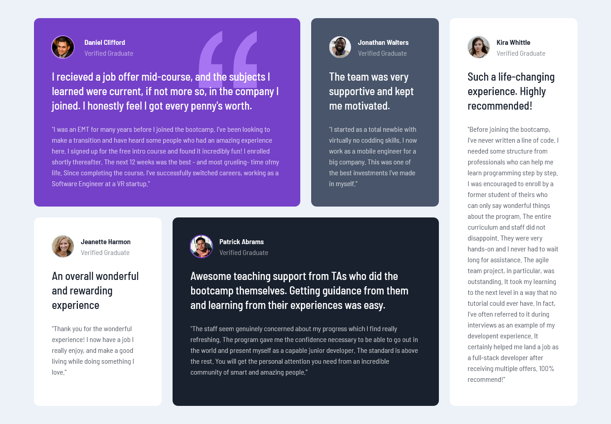

# Frontend Mentor - Testimonials grid section solution

This is a solution to the [Testimonials grid section challenge on Frontend Mentor](https://www.frontendmentor.io/challenges/testimonials-grid-section-Nnw6J7Un7). Frontend Mentor challenges help you improve your coding skills by building realistic projects. 

### Screenshot

### Links

- Solution URL: [solution](https://github.com/tugcekizildg/Testimonials_Grid_Challenge_FEM)
- Live Site URL: [live-preview](hhttps://66a35738bc7eee4fe7887194--gilded-tulumba-c62301.netlify.app)

## My process

### Built with

- Semantic HTML5 markup
- CSS Grid
- Mobile-first workflow
- Tailwind CSS

## Author

- Website - [tugcekizildg](https://github.com/tugcekizildg)
- Frontend Mentor - [@tugcekizildg](https://www.frontendmentor.io/profile/tugcekizildg)

